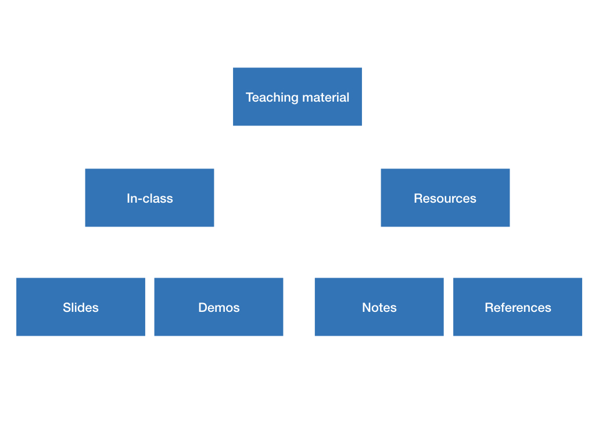

layout:true

<div class="my-header">
<span class='header'>DC R conference, 2019</span>
<span class='header2'>Abhijit Dasgupta</span>
</div>

---

```{r setup, include = F}
knitr::opts_chunk$set(eval=F, echo=T)
```


## Who am I?

+ Co-founded Stat Programming DC with Marck
+ Sat on the Board of DCDC

--
+ Biostatistican by trade (NIH)
    - Research, collaboration and reviews
+ Data science at a startup (Zansors)
    - stats, signal processing, business dev
--
+ Teaching R (FAES Graduate School at NIH, State Dept, elsewhere)

---

## Who am I?

+ Co-founded Stat Programming DC with Marck
+ Sat on the Board of DCDC
+ Biostatistican by trade (NIH)
    - Research, collaboration and reviews
+ Data science at a startup (Zansors)
    - stats, signal processing, business dev
+ .heatinline[Teaching R (FAES Graduate School at NIH, State Dept, elsewhere)]

---

## Teaching at FAES


---

# Teaching at FAES


---

## Teaching workshops


---

```{r, echo=F, eval=T, out.height=600, out.width=900}

```

---

```{r, echo=F, eval=T,out.height=600, out.width=900}
knitr::include_graphics('img/graphics/graphics.002.jpeg')
```

---

```{r, echo=F, eval=T,out.height=600, out.width=900}

```

---

```{r, echo=F, eval=T, out.height=600, out.width=900}

```

---

```{r, echo=F, eval=T, out.height=600, out.width=900}

```

---

## Concept

### Create a RMarkdown website

--

### Slides with `xaringan`

--

### Homework with RMarkdown

--

### Notes with `bookdown`

---

## But....

### Need to produce new material and update

--

### Update website and not rebuild everytime (make??)

--

### Some kind of table of contents for lectures, homeworks

--

### Automate processes (syllabus, receiving homework, grading, recording grades)

---

## Syllabus

```{r, echo=T}
startDate <- lubridate::ymd('20190911')
classDate <- function(wk, startDate ){ #<<
  today <- startDate + 7*(wk-1) #<<
  return(format(today, "%B %d, %Y")) #<<
}

dts <- classDate(1:14, startDate)
topics <- c(
  'Introduction to R, RStudio and RMarkdown',
  'Data Structures in R (classes 5:30-7, 7-8:30)',
  'R packages, data import/export, munging',
  'Towards analytic data: Data Munging, continued',
  'Data exploration through visualization',
  'More data visualization and RMarkdown',
  'Statistical analyses: Table 1, estimation and confidence intervals, and more ggplot',
  'Statistical analyses: Classical hypothesis testing and computational inference',
  'Statistical learning: Regression models',
  "More data munging with `purrr`: grouping, mapping and functional programming",
  "Basic bioinformatics: Bioconductor and friends",
  "No class (Thanksgiving)",
  'Statistical learning: Cluster analysis and pattern recognition',
  "Project presentations")
D <- tibble(Date = dts, Topic=topics) #<<
knitr::kable(D)
```

Automatically populate dates

---

## Syllabus


---

## Lectures 

#### Table of contents

```{r, echo=T}
parse_title <- function(f){
  if(is.na(f)) return(NA)
  rmarkdown::yaml_front_matter(f)$title
}

rmds <- dir_ls('lectures', regex = '\\d{2}.*.Rmd')
htmls <- str_replace(rmds, 'Rmd','html')
pdfs <- str_replace(rmds, 'Rmd','pdf')

blah <- Reduce(full_join, list(htmls, pdfs,rmds)) %>% 
  select(base, everything())
blah <- blah %>% tidyr::gather(variable, value, -base) %>% 
  mutate(value = glue('[{variable}]({value})')) %>% 
  mutate(value = ifelse(str_detect(value, 'NA'), '', value)) %>%
  spread(variable, value) %>% 
  rename(Lecture=base) %>% 
  mutate(Title = map_chr(str_match(Rmd, '\\((.+)\\)')[,2],parse_title))

kable(blah) %>%
  kable_styling(bootstrap_options='striped', full_width = T)
```

---

## Lectures 

#### Table of contents

```{r, echo=T}
parse_title <- function(f){ #<<
  if(is.na(f)) return(NA) #<<
  rmarkdown::yaml_front_matter(f)$title #<<
} #<<

rmds <- dir_ls('lectures', regex = '\\d{2}.*.Rmd')
htmls <- str_replace(rmds, 'Rmd','html')
pdfs <- str_replace(rmds, 'Rmd','pdf')

blah <- Reduce(full_join, list(htmls, pdfs,rmds)) %>% 
  select(base, everything())
blah <- blah %>% tidyr::gather(variable, value, -base) %>% 
  mutate(value = glue('[{variable}]({value})')) %>% 
  mutate(value = ifelse(str_detect(value, 'NA'), '', value)) %>%
  spread(variable, value) %>% 
  rename(Lecture=base) %>% 
  mutate(Title = map_chr(str_match(Rmd, '\\((.+)\\)')[,2],parse_title))

kable(blah) %>%
  kable_styling(bootstrap_options='striped', full_width = T)
```

Automatically grab slide titles from the slides

---

## Lectures 

#### Table of contents

```{r, echo=T}
parse_title <- function(f){
  if(is.na(f)) return(NA)
  rmarkdown::yaml_front_matter(f)$title
}

rmds <- dir_ls('lectures', regex = '\\d{2}.*.Rmd')
htmls <- str_replace(rmds, 'Rmd','html')
pdfs <- str_replace(rmds, 'Rmd','pdf')

blah <- Reduce(full_join, list(htmls, pdfs,rmds)) %>% 
  select(base, everything())
blah <- blah %>% tidyr::gather(variable, value, -base) %>% 
  mutate(value = glue('[{variable}]({value})')) %>% #<<
  mutate(value = ifelse(str_detect(value, 'NA'), '', value)) %>%
  spread(variable, value) %>% 
  rename(Lecture=base) %>% 
  mutate(Title = map_chr(str_match(Rmd, '\\((.+)\\)')[,2],parse_title))

kable(blah) %>%
  kable_styling(bootstrap_options='striped', full_width = T)
```

I use `glue` a lot for automating link creation

---

## Lectures


---

## Homeworks

```{r}
solutions <- dir_ls('HW', glob = '*Solution.html', fail=F)
hws <- dir_ls('HW', regex="HW\\d+.html", fail=F)
hws <- setdiff(hws, solutions)
rmds <- dir_ls('HW', regexp = 'HW\\d+.Rmd')
numbers <- sort(unique(stringr::str_match(hws, 'HW(\\d+)')[,2]))
ind <- match(glue('HW/HW{i}_Solution.html', i=numbers), solutions)
out_data <- tibble(n = numbers, rmds = sort(rmds), hws = sort(hws), solutions = solutions[ind])

out <- tibble('Homework' = glue_data(out_data,'[Homework {n}]({hws})'), #<<
              'R Markdown' = glue_data(out_data, #<<
                                       '[R Markdown]({rmds})'), #<<
              'Solutions' = ifelse(!is.na(out_data$solutions), #<<
                                   glue_data(out_data,'[Solution]({solutions})'),#<<
                                   ''))#<<
```

Automatically create homework and solution links

Provide RMD files as template for submission
---

## Homework


---

## Homework


--

.pull-left[
```{r}
library(reticulate)
source_python('create_request.py')
a <- py$create_request('2019-11-07T00:00:00',
                       'Homework 8',
                       '/BIOF339_Fall2019/Homeworks/HW8')
```
]
.pull-right[
```{python, eval=F}
def create_request(timestamp, name, directory, late=True, token=tk):
  """
  Create a file request in Dropbox, with a deadline 
  (only for Business or Professional accounts)
  
  INPUTS:
  
  timestamp: The deadline date and time in ISO 8601 format (YYYY-MM-DDThh:mm:ss)
             in local time
  name:      The title of the file request
  directory: The destination directory for the file request. 
             It must start with '/' for the top level Dropbox directory
  late :     True/False; if True a grace period of 1 day is added.
  token:     Dropbox authentication token
  """
```
]

???

`reticulate` is really fantastic

Dropbox Python API (due to GVR?)
---

## Homework evaluation


+ Homework submission as RMarkdown documents via Dropbox
    - Dropbox attaches student names to files
+ I run the document, provide comments in RMarkdown, and put grade on last line
    - Emphasize standard project structure, `here`
+ Script to parse grades from submissions, with names, and update a CSV file
    - Can see who has submitted which homework, and scores
+ Email commented homework back 
    - `gmailr` & class email list
--
+ .heatinline[Have not played with `learnr` and `grader`]

???
Jenny Bryan's work on naming conventions, parsable filenames

Dan Chen's summer internship on `grader`
---

## Maintenance and upkeep

Use `drake` (one choice out of many)

.pull-left[
```{r}
slides_plan <- drake_plan(
  create_slides_html = target(
    rmarkdown::render(knitr_in(rmdf), output_dir=slides_outdir),
    transform = map(rmdf=!!slides_rmdfiles)
  ),
  create_slides_pdf = target(
    coursedown::slide2pdf(knitr_in(rmdf)),
    transform = map(rmdf = !!slides_rmdfiles)
  ),
  create_index = target(
    rmarkdown::render_site(knitr_in('slides/index.Rmd')),
    trigger = trigger(depend =T, file=T, command=T, 
                      change = max(map_dbl(!!slides_rmdfiles, 
                                       function(x) file.info(x)$mtime)))
  )
)
```
]
.pull-right[
```{r}
hw_plan <- drake_plan(
  create_hw_html = target(
    rmarkdown::render(knitr_in(rmdf), output_dir = hw_outdir),
    transform = map(rmdf = !!hw_rmdfiles)
  ),
  create_index = target(
    rmarkdown::render_site(knitr_in('slides/index.Rmd')),
    trigger = trigger(depend=T, file=T, command=T,
                      change = max(map_dbl(!!hw_rmdfiles, 
                                           function(x) file.info(x)$mtime)))
  )
)

```

]

---

## Maintenance and upkeep

Use `drake` (one choice out of many)

.pull-left[
```{r}
slides_plan <- drake_plan(
  create_slides_html = target(
    rmarkdown::render(knitr_in(rmdf), output_dir=slides_outdir),
    transform = map(rmdf=!!slides_rmdfiles)
  ),
  create_slides_pdf = target(
    coursedown::slide2pdf(knitr_in(rmdf)), #<<
    transform = map(rmdf = !!slides_rmdfiles)
  ),
  create_index = target(
    rmarkdown::render_site(knitr_in('slides/index.Rmd')),
    trigger = trigger(depend =T, file=T, command=T, 
                      change = max(map_dbl(!!slides_rmdfiles, 
                                       function(x) file.info(x)$mtime)))
  )
)
```

Uses `pagedown::chrome_print`.

My students seem to demand PDFs
]
.pull-right[
```{r}
hw_plan <- drake_plan(
  create_hw_html = target(
    rmarkdown::render(knitr_in(rmdf), output_dir = hw_outdir),
    transform = map(rmdf = !!hw_rmdfiles)
  ),
  create_index = target(
    rmarkdown::render_site(knitr_in('slides/index.Rmd')),
    trigger = trigger(depend=T, file=T, command=T,
                      change = max(map_dbl(!!hw_rmdfiles, 
                                           function(x) file.info(x)$mtime)))
  )
)

```

]

---

## Maintenance and upkeep

Use `drake` (one choice out of many)

.pull-left[
```{r}
slides_plan <- drake_plan(
  create_slides_html = target(
    rmarkdown::render(knitr_in(rmdf), output_dir=slides_outdir),
    transform = map(rmdf=!!slides_rmdfiles)
  ),
  create_slides_pdf = target(
    coursedown::slide2pdf(knitr_in(rmdf)),
    transform = map(rmdf = !!slides_rmdfiles)
  ),
  create_index = target(  #<<
    rmarkdown::render_site(knitr_in('slides/index.Rmd')), #<<
    trigger = trigger(depend =T, file=T, command=T,  #<<
                      change = max(map_dbl(!!slides_rmdfiles,  #<<
                                       function(x) file.info(x)$mtime))) #<<
  )
)
```

Automatically updates the TOC
]
.pull-right[
```{r}
hw_plan <- drake_plan(
  create_hw_html = target(
    rmarkdown::render(knitr_in(rmdf), output_dir = hw_outdir),
    transform = map(rmdf = !!hw_rmdfiles)
  ),
  create_index = target(
    rmarkdown::render_site(knitr_in('slides/index.Rmd')),
    trigger = trigger(depend=T, file=T, command=T,
                      change = max(map_dbl(!!hw_rmdfiles, 
                                           function(x) file.info(x)$mtime)))
  )
)

```

]

---

## The `coursedown` package (at github.com/webbedfeet/coursedown)

.pull-left[
+ Structure project as a website with 3 sub-websites
    - Lectures,  Homework,  Notes
+ Common top level links
+ Assumes deployment via GitHub Pages 
+ Creates directory structure
+ Provides templates for slides, homeworks, notes, top-level `index.Rmd` for each website


]
.pull-right[
`_course.yml`
```yaml
course_shortname: BIOF339
course_name: Practical R
instructor: Abhijit Dasgupta
description: ''
course_url: http://www.araastat.com/BIOF339
dates: Fall, 2019
slack: 'biof339'
short_repo: araastat/BIOF339
twitter: webbedfeet
course_shortname1: BIOF339
github: https://www.github.com/araastat/BIOF339
slack_channel: https://biof339.slack.com
```

+ Common branding and labeling via yaml
]

--
#### Very much a work in progress

---

## Wrapping up

+ Many opinionated choices, based on what I wanted to learn
+ .saltinline[Would love collaboration to fix the kinks]

--

------
.center[.heat[Thank you]]

```{r, include=F}
library(fontawesome)
```

`r fontawesome::fa(name='home')` [webbedfeet.netlify.com](https://webbedfeet.netlify.com)
`r fontawesome::fa(name='twitter')` @webbedfeet  
`r fontawesome::fa(name='github')` [webbedfeet/coursedown](https://www.github.com/webbedfeet/coursedown)

